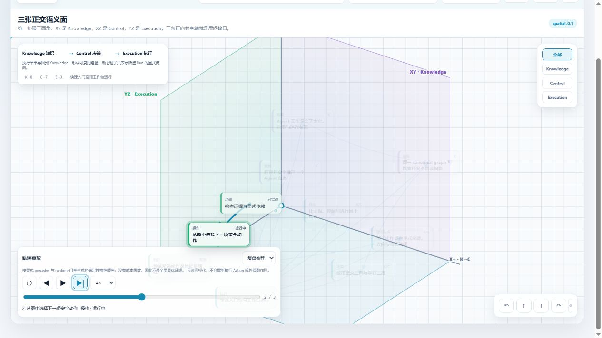

# Agent Case Graph

[](https://github.com/znbsf/agent-case-graph/actions/workflows/tests.yml)
[](LICENSE)
[](https://www.python.org/)

**Evidence-first graph protocol and spatial workbench for auditable agent runs.**

Agent Case Graph（ACG）把 Agent 处理问题的过程保存为 append-only JSONL，再确定性投影为知识图、控制图和执行状态。它关注的不只是“画一张图”，而是让图回答：

- 我们知道什么，证据来自哪里？
- 哪个动作现在允许执行，为什么？
- 这次 Run 实际走到了哪里，下一步是什么？
- 哪些结论经过验证，哪些仍是 reconstructed 或 uncertain？

> Status: `v0.1.0` alpha。运行时可以选路、解释阻塞并验证 Checkpoint，但不会自动执行任意 shell 命令。



## 核心结构

```text
Append-only Event Ledger
          |
          v
Canonical typed graph
  | Knowledge: Case / Evidence / Observation / Claim / Decision
  | Control:   Goal / Run / Step / Approval / Dependency / Gate
  | Execution: Ready / Running / Blocked / Completed / Checkpoint
          |
          +--> First-octant trihedral: XY Knowledge / XZ Control / YZ Execution
          +--> Parallel layers:   Knowledge / Control / Execution
          +--> Replay: recorded Ledger / retrospective recommendation
```

同一个 canonical node 可以出现在多个投影中，但共享稳定 ID。页面坐标、卡片位置和记录顺序都不会被升级成新的因果事实。

## 两个主要工作面

- **正交三面**：在 `x/y/z >= 0` 的第一卦限中斜向展示三张正交面；从空间关系观察 `Knowledge / Control / Execution` 的接口和信息去向。
- **平行三层**：把三层拉开，适合日常沿着显式箭头阅读和定位。

旧式的“信息流 / 执行控制 / 结构图 / 时间线 / 质量”不会形成五个独立页面：canonical 关系成为空间箭头，所选 Run 的显式路径成为方向粒子，runtime 状态叠加在节点上，事件、Lint 和节点来源进入统一侧栏。

HTML 由原生 SVG、HTML 和 JavaScript 组成，自包含、无 CDN，可以离线直接打开。

## 快速开始

```bash
git clone https://github.com/znbsf/agent-case-graph.git
cd agent-case-graph
python -m venv .venv
python -m pip install -e .

acg doctor --ledger examples/quickstart/events.jsonl
acg validate-ledger examples/quickstart/events.jsonl
acg lint --strict examples/quickstart/events.jsonl
acg project examples/quickstart/events.jsonl \
  --out-dir examples/quickstart/generated \
  --title "Agent Case Graph Quickstart" \
  --default-locale zh-CN
```

然后打开：

```text
examples/quickstart/generated/graph.html
```

公开示例全部标记为 `capture_mode=synthetic`。它故意保留一个 Running Action 和一个被前置关系阻塞的 Verification，以便展示 runtime overlay；不会触发任何外部操作。

## 创建自己的 Case

```bash
acg init-case \
  --ledger my-case/events.jsonl \
  --case-id MY-CASE-001 \
  --title "Investigate a reproducible problem" \
  --capture-mode live

acg record-node --ledger my-case/events.jsonl \
  --case-id MY-CASE-001 \
  --run-id run:MY-CASE-001:001 \
  --node-id observation:MY-CASE-001:001 \
  --node-type Observation \
  --label "Observed fact" \
  --attrs '{"status":"confirmed"}'

acg project my-case/events.jsonl --out-dir my-case/generated
```

PowerShell 用户也可以直接运行仓库根目录的 `acg.ps1`。

## 图如何辅助执行

只有显式声明 `attrs.runtime_managed=true` 且被目标 Run `contains` 的 `Step / Action / Verification` 才进入 runtime。

```text
next-actions(run)
  -> 检查 precedes / blocked_by / approved_by
  -> 输出 ready / running / blocked / completed / failed
  -> 为 Ready 节点生成最小上下文包

step-status(node, running|completed|failed|blocked|skipped)
  -> 重新检查门禁
  -> 追加持久化 Checkpoint 事件
  -> 重新计算下一 Ready frontier
```

Mutating Action 还必须同时满足：

- 有显式 `targets` 或 `modifies` 关系；
- 有 `status=granted` 且 scope 覆盖 `authorized_scope` 的 Approval；
- Case 处于 `execute`；
- Run 是 `capture_mode=live`。

Runtime 只负责“选什么、为什么、是否允许、完成后下一步是什么”。实际工具调用属于独立 executor adapter。

## 双轨重放

空间工作台中的“轨迹重放”有两条相互独立的轨道：

- **实际记录**：严格按 Ledger `sequence` 逐事件回看；`occurred_at` 只用于显示。它是只读可视化，不会重新执行 Action、工具调用或外部副作用。
- **复盘推荐**：只使用所选 Run 内的 runtime-managed 节点和显式 `precedes` 边，按 runtime 门禁及 `(priority, first_sequence, node_id)` 生成稳定拓扑顺序。

“复盘推荐”不是全局最优证明：当前没有完整替代分支、声明的成本函数和完备成本数据。页面会始终显示这个边界。

轨迹真实性由 `capture_mode` 决定：`live` 是处理过程中写入的 Ledger 事件，但原始工具输入输出仍可能不完整；`reconstructed` 是历史证据重建，不是原始逐步轨迹；`synthetic` 只用于演示。公开 Quickstart 因此显示“示例事件回看”，不会冒充真实执行。

## 事实与隐私边界

```text
events.jsonl + original artifacts = source of truth
graph.json / graph.mmd / graph.html = rebuildable projections
```

- `live`：处理过程中真实记录。
- `reconstructed`：事后从既有资料重建，不能冒充原始执行轨迹。
- `synthetic`：测试或演示数据。

生成的 HTML 会内嵌完整 graph 与 event 数据。发布前必须同时审查 Ledger、来源引用和生成物；不要把客户日志、内部路径、凭证或未脱敏证据提交到公开仓库。

本仓库只包含 synthetic Quickstart，不包含任何内部 Case、客户日志或本机路径。

## 命令概览

```text
doctor            检查 Python、协议 schema 和可选 Ledger
init-case         创建新的 live/synthetic Ledger
validate-ledger   校验 JSONL 结构与连续序号
lint              执行确定性协议检查
project           生成 HTML / JSON / Mermaid / Lint / SHA256 receipt
next-actions      计算 Ready frontier、阻塞原因和最小上下文
step-status       写入受门禁保护的 runtime Checkpoint
import-issue      只读导入一个历史 Issue 目录
record-node       追加节点事件
record-edge       追加关系事件
record-state      追加 Case 状态变化
```

## 开发与验证

```bash
python -m pip install -e .
python -m unittest discover -s tests -v
python -m compileall -q agent_case_graph
python -m pip wheel --no-deps --wheel-dir .artifacts/wheel .
```

当前测试覆盖 Ledger 连续性、历史只读导入、Lint、状态机、Ready frontier、Approval scope、Checkpoint、空间目录确定性、sequence-authoritative 重放、推荐路径环检测、本地化和自包含 HTML。

## 设计文档

- [MVP architecture](docs/architecture.md)
- [Open-source runtime and visualization comparison](docs/runtime-open-source-comparison.md)
- [Contributing](CONTRIBUTING.md)
- [Security and data boundary](SECURITY.md)

## 已知边界

- 尚无跨 Case 索引、Graph DB、Skill 自动晋升或 Experience Store。
- 尚无并行 join、lease/claim、多进程 executor、自动 retry、执行级 replay 或 fork；现有 replay 只重放 Ledger 的视觉状态，不重放工具与副作用。
- SVG 空间视图是确定性 2.5D 投影，不是 WebGL 自由漫游引擎。
- Importer 只能结构化提取明确支持的 Markdown/Manifest；语义 Curation 仍需审查。

## License

[MIT](LICENSE)
