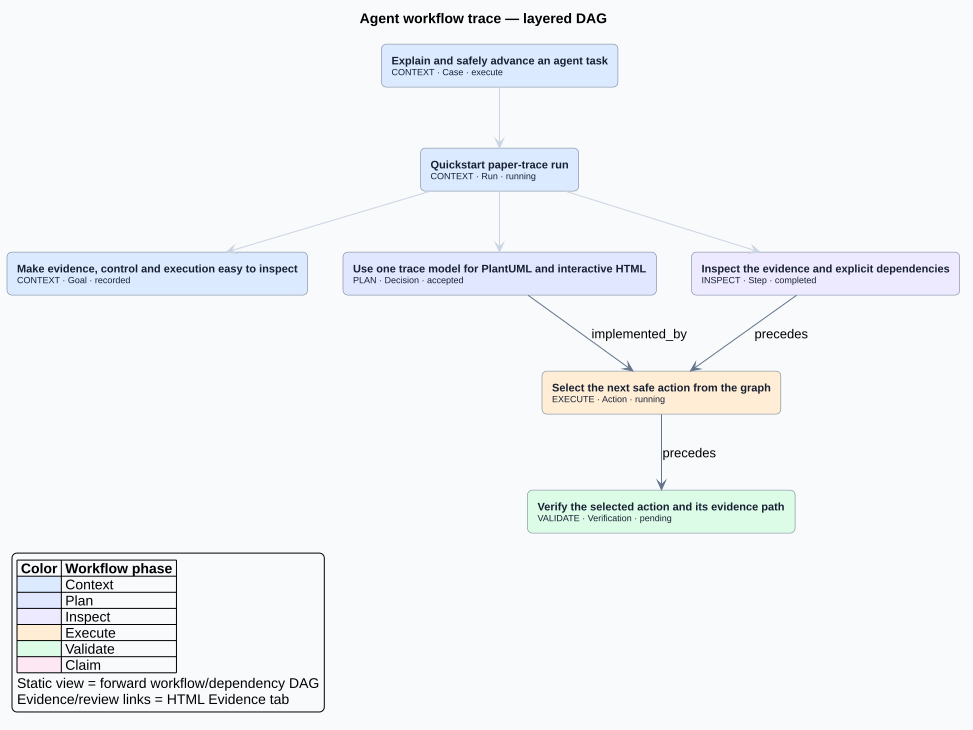

# Agent Case Graph

[](https://github.com/znbsf/agent-case-graph/actions/workflows/tests.yml)
[](LICENSE)
[](https://www.python.org/)

**Append-only agent trace protocol with a paper-inspired layered DAG review surface.**

Agent Case Graph（ACG）把 Agent 的操作、证据、产物和结论先保存为 append-only JSONL，再投影为同一个 `paper-trace-0.1` 模型：

- `trace.puml`：可评审、可版本比较的 PlantUML 静态基准图；
- `graph.html`：自包含三栏工作台，支持 Loop Overview / Workflow / Evidence / Trace 下钻；
- `loop-model.json`：由 canonical graph 派生的双循环聚合索引；
- `trace-model.json`：两种渲染器共享的唯一展示契约；
- `graph.json`：完整 canonical typed graph。

新版刻意不提供 3D 平面、五套重复工作台或自动布局语义。图只回答三个问题：

1. 这项工作经历了哪些阶段？
2. 结论由哪些动作、产物和检查支持？
3. 选中一个节点后，能否回到原始 Trace Record？

## 论文对应

视觉语法主要来自：

- [Graph of Trace, ACL 2026](https://aclanthology.org/2026.acl-demo.29/)：左侧逐步操作、中间自上而下 DAG、右侧节点详情；
- [LEDGER, arXiv:2608.18398](https://arxiv.org/abs/2608.18398)：`Trace Records -> Evidence Nodes -> Workflow Nodes`，以及 `context / plan / inspect / execute / validate / claim` 六阶段；
- [AgentDiagnose, EMNLP 2025](https://aclanthology.org/2025.emnlp-demos.15/)：不同诊断视图联动，但不把所有分析塞进核心 DAG。

这里借鉴的是可读性和审计结构，不复制论文界面或数据。



仓库保留一份可直接评审的 [Quickstart PlantUML 基准](examples/paper-trace/quickstart.puml)；CLI 生成结果仍以 Ledger 为准，可随时重建。

## 数据流

```text
events.jsonl
  append-only · live | reconstructed | synthetic
        |
        v
Canonical Graph
  stable IDs · typed nodes/edges · lint · runtime gates
        |
        v
paper-trace-0.1 + loop-projection-0.1
  Dialogue Round · Execution Iteration · Workflow Phase · Evidence · Trace
        |
        +--> trace.puml
        +--> graph.html
```

页面位置、Ledger 时间和卡片顺序都不会自动成为因果。只有显式 edge 才进入关系图。

## 快速开始

```bash
git clone https://github.com/znbsf/agent-case-graph.git
cd agent-case-graph
python -m venv .venv
python -m pip install -e .

acg validate-ledger examples/quickstart/events.jsonl
acg lint --strict examples/quickstart/events.jsonl
acg project examples/quickstart/events.jsonl \
  --out-dir examples/quickstart/generated \
  --title "Agent Case Graph Quickstart" \
  --default-locale zh-CN
```

打开 `examples/quickstart/generated/graph.html`，或使用 PlantUML 渲染 `trace.puml`：

```powershell
.\scripts\render-plantuml.ps1 `
  -InputPath .\examples\quickstart\generated\trace.puml `
  -JarPath C:\path\to\plantuml.jar `
  -Format svg
```

PowerShell 用户可以直接运行仓库根目录的 `acg.ps1`。

## HTML 的四个粒度

- **Loop Overview**：把外层用户对话轮次与内层 Agent 执行迭代分开显示；点击聚合点可查看成员并展开。
- **Workflow**：六阶段自上而下 DAG，查看 Goal / Plan / ToolCall / Output 的完整流程。
- **Evidence**：只保留可审计节点及 evidence/provenance 关系，从 Claim 反查支持链。
- **Trace**：按 Ledger `sequence` 显示原始记录；顺序不是因果。

三栏固定职责：左侧原始 Trace，中间 DAG，右侧选中节点的属性、工具、产出、上下游关系和源记录。

## 双循环与图化简

```text
DialogueRound (外层：用户输入/反馈 -> Goal 修订 -> AgentResponse)
  └─ ExecutionIteration (内层：Plan -> ToolCall -> ToolOutput -> Evaluation)
```

`contains` 只声明作用域，不声明因果；同层先后仍必须使用显式 `precedes`。聚合点只存在于 projection，不会写回 Ledger。每个聚合点保存 `member_ids / internal_edge_ids / cycle_edge_ids`，跨组边保存原始 edge ID、端点和 provenance。未归组节点与边显式列在 `unmapped_node_ids / unmapped_edge_ids`，因此化简不会冒充事实删除。

没有 `UserFeedback` 或父子 `contains` 证据时，Plan fallback 只叫 display/execution span，不声称它就是一次真实用户对话。`accepted` 缺失时，首轮是否成功始终为 unknown。

## 底层能力保留

- canonical node/edge 和稳定 ID；
- append-only Ledger 与 SHA256 receipt；
- `live / reconstructed / synthetic` 真实性边界；
- deterministic lint；
- runtime Ready frontier、Approval scope 和 Checkpoint；
- visual-only replay，不重新执行工具或副作用。

## 从图反推流程

ACG 可以显式记录 `Goal -> Plan -> ToolCall -> ToolOutput -> Claim`：

- `frames`：Goal 为 Plan 提供上下文和边界；
- `informs`：新证据或可见 reasoning summary 改变下一版 Plan；
- `supersedes`：Goal/Plan 的版本修订；
- `invokes / produces / supports`：计划调用工具、工具产生结果、结果支撑结论。

`infer-workflow` 只读取 canonical graph，反推每版 Plan 的 Goal 上下文、动作、产出和结论，并报告缺失的 Goal/Plan/Output/Evidence 关系。它不读取或恢复隐藏 chain-of-thought。

```bash
acg infer-workflow examples/quickstart/events.jsonl --output inferred-workflow.json
```

## 事实与隐私边界

```text
events.jsonl + original artifacts = source of truth
graph.json + trace-model.json + trace.puml + graph.html = rebuildable projections
```

生成的 HTML 内嵌 Trace 数据。公开前必须检查 Ledger、来源引用和生成物，禁止提交客户日志、内部路径、凭证或未脱敏证据。仓库 Quickstart 全部是 synthetic 数据。

## 命令

```text
doctor            检查 Python、schema 和可选 Ledger
init-case         创建 live/synthetic Ledger
validate-ledger   校验 JSONL 与连续 sequence
lint              执行确定性协议检查
project           生成 PlantUML / HTML / JSON / Lint / receipt
next-actions      计算 Ready frontier 与阻塞原因
step-status       追加受门禁保护的 runtime Checkpoint
import-issue      只读导入历史 Issue
infer-workflow    仅从 canonical graph 反推 Goal/Plan/Tool/Output/Claim
record-node       追加节点事件
record-edge       追加关系事件
record-state      追加状态变化
```

## 开发验证

```bash
python -m unittest discover -s tests -v
python -m compileall -q agent_case_graph
python -m pip wheel --no-deps --wheel-dir .artifacts/wheel .
```

设计细节见 [architecture.md](docs/architecture.md) 和 [paper visualization notes](docs/runtime-open-source-comparison.md)。

## License

[MIT](LICENSE)
